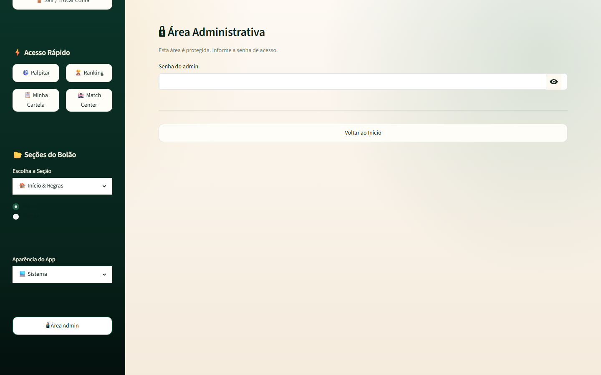
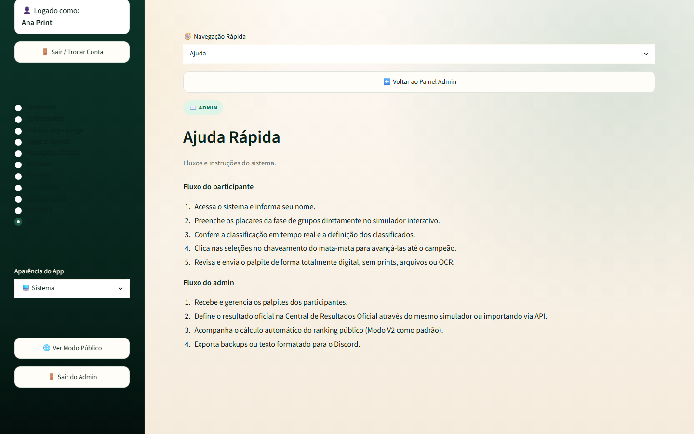
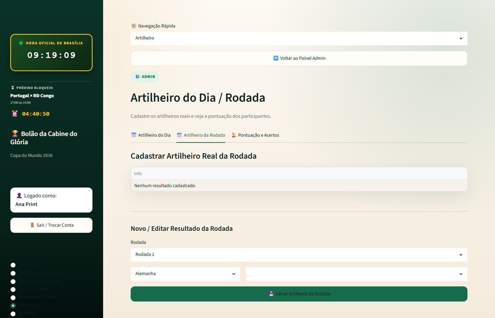
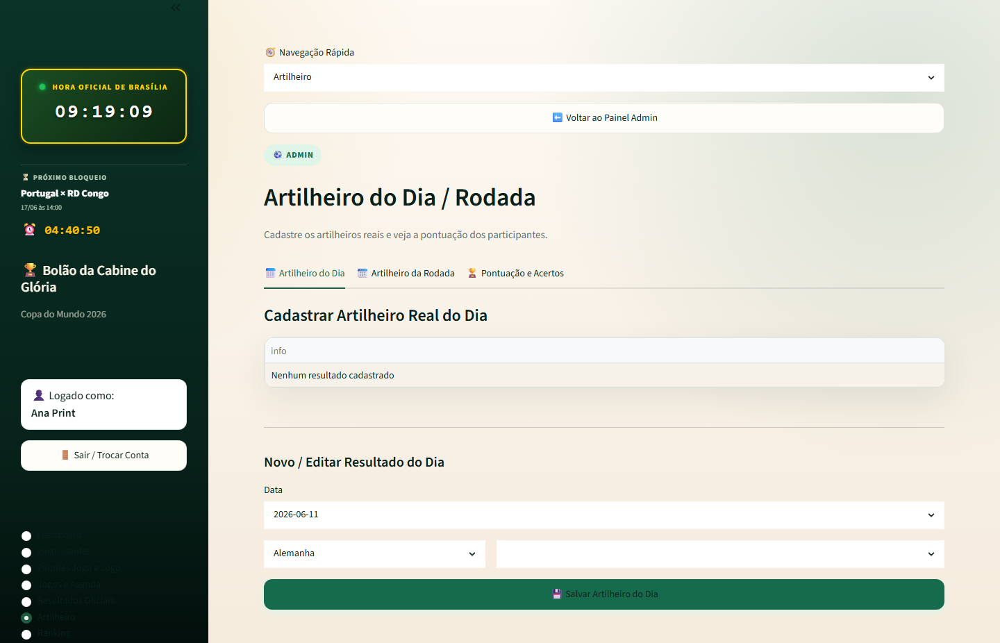

<div align="center">
  

  <h1>Bolão da Cabine do Glória</h1>

  <p><strong>Bolão Copa 2026 com simulador, conferência e ranking — Streamlit + Supabase.</strong></p>
  <p><strong>World Cup 2026 pool with simulator, scoring and ranking — Streamlit + Supabase.</strong></p>

  <p>
    <a href="#pt-br">PT-BR</a>
     · 
    <a href="#english">English</a>
     · 
    <a href="#stack">Stack</a>
     · 
    <a href="#architecture">Architecture</a>
     · 
    <a href="#quick-start">Quick Start</a>
     · 
    <a href="#author">Author</a>
  </p>

  <p>
    
    
    
    
  </p>

  <p>
    <a href="https://github.com/BarujaFe1/Bol-o-CabineDoGl-ria"><strong>Repo</strong></a>
     · 
    <a href="https://barujafe.vercel.app/"><strong>Portfolio</strong></a>
     · 
    <a href="https://www.linkedin.com/in/barujafe/"><strong>LinkedIn</strong></a>
  </p>
</div>


> **Community app notice:** Streamlit app for a specific community pool. No GitHub homepage demo URL is set. Deploy on Streamlit Community Cloud with **your** Supabase secrets. Repo name encoding: `Bol-o-CabineDoGl-ria`.

---

## PT-BR

### Visão geral
O **Bolão da Cabine do Glória** gerencia palpites da Copa 2026 com áreas pública/admin, regras de pontuação (incl. modo V2), simulador/apoio GE, artilheiro do dia/rodada, exportações e persistência Supabase.

### Problema
Bolões em planilha quebram com empates, revisões de placar e falta de ranking confiável para um grupo real.

### Para quem
O grupo **Cabine do Glória** / comunidades que querem um bolão operacional com admin e ranking.

### Funcionalidades
- Área pública de participação e fluxo de palpites
- Área administrativa (placar oficial, config, artilheiros)
- Múltiplos modos/regras de pontuação (V2 documentado)
- Exportações (CSV/JSON/ranking Discord helpers)
- Parser/apoio a texto de chaves (GE) no código
- Screenshots de admin em `./screenshots`

### Escopo e limites (honestos)
- App de comunidade — não é produto SaaS multi-tenant genérico
- Requer Supabase + senha admin configurados
- Simulador/parser GE são apoio — valide placares oficiais

---

## English

### Overview
**Bolão da Cabine do Glória** runs a WC2026 pick’em with public/admin areas, scoring rules (incl. V2), simulator/GE helpers, daily/round scorers, exports and Supabase persistence.

### Problem
Spreadsheet pools break on ties, score revisions and unreliable rankings for a real group.

### Who it is for
The **Cabine do Glória** community / groups that need an operational pool with admin + ranking.

### Features
- Public participation and pick flow
- Admin area (official scores, config, scorers)
- Multiple scoring modes/rules (V2 documented)
- Exports (CSV/JSON/Discord ranking helpers)
- GE bracket text parser/helpers in code
- Admin screenshots under `./screenshots`

### Scope and honest limits
- Community app — not generic multi-tenant SaaS
- Needs Supabase + admin password configuration
- GE simulator/parser are helpers — verify official scores

---

## Screenshots

<table>
  <tr>
    <td width="50%"><br /><sub><strong>Admin login</strong></sub></td>
    <td width="50%"><br /><sub><strong>Admin help</strong></sub></td>
  </tr>
  <tr>
    <td width="50%"><br /><sub><strong>Top scorer round</strong></sub></td>
    <td width="50%"><br /><sub><strong>Top scorer day</strong></sub></td>
  </tr>
</table>


## Stack

| Layer | Technology |
|---|---|
| UI | Streamlit |
| Language | Python 3.11+, Pandas |
| Data | Supabase (production), local JSON/state helpers |

---

## Architecture

```txt
app.py                 Streamlit entry
src/bolao/             domain (scoring, storage, UI, parsers)
supabase_migrations/   SQL migrations
screenshots/           admin UI evidence
```

---

## Quick Start

```bash
python -m venv .venv
.venv\Scripts\activate
pip install -r requirements.txt
cp .env.example .env   # or .streamlit/secrets.toml
streamlit run app.py
```

---

## Technical decisions

- **Streamlit** for fast community iteration
- **Supabase** for shared persistence beyond local JSON
- Explicit **scoring modes** + tie-breakers for fair rankings

---

## Roadmap

- UX polish for participants
- Stronger admin audit trail
- Closer sync with Discord CopaBot

---

## Author

**Felipe Alirio Baruja** — data / product / full-stack portfolio.

- Portfolio: [https://barujafe.vercel.app/](https://barujafe.vercel.app/)
- GitHub: [https://github.com/BarujaFe1](https://github.com/BarujaFe1)
- LinkedIn: [https://www.linkedin.com/in/barujafe/](https://www.linkedin.com/in/barujafe/)


## License

MIT — see [`LICENSE`](./LICENSE).
